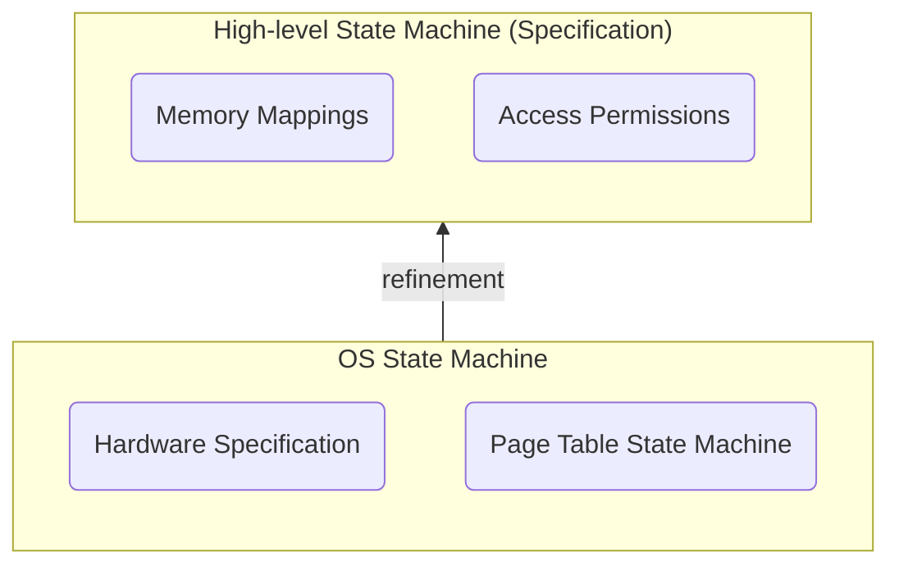

# Verifying hvisor Page Table

## Specification



The verification of the page table implementation is structured around a **refinement-based approach**, where lower-level specifications refine higher-level abstractions. This ensures that the implementation adheres to the desired security and functional properties.

### High-Level State Machine (Specification)

The high-level state machine defines the abstract behavior of the memory system, focusing on:

1. **Memory Mappings**
   - Virtual-to-physical address translations.
   - Consistency of mappings across operations.
2. **Access Permissions**
   - Read, write, and execute permissions.
   - User vs. kernel mode access control.

This specification represents the **proof target**. Our implementation running in the intended environment should refine it. This is demonstrated in part by the proof that the OS-level state machine refines this specification.

```rust
/// High level memory state.
pub struct HlMemoryState {
    /// Word-indexed memory.
    pub mem: Seq<nat>,
    /// Mappings from virtual addr to physical frames.
    pub mappings: Map<nat, Frame>,
}

impl HlMemoryState {
    /// State transition - Read & Write
    pub open spec fn read_write(s1: Self, s2: Self, vaddr: nat, write: bool) -> bool {
		// ...
    }

    /// State transtion - Map a virtual address to a frame.
    pub open spec fn map(s1: Self, s2: Self, vaddr: nat, frame: Frame) -> bool {
		// ...
    }

    /// State transtion - Unmap a virtual address.
    pub open spec fn unmap(s1: Self, s2: Self, vaddr: nat) -> bool {
		// ...
    }
}
```

### OS State Machine

The OS state machine bridges the gap between the high-level specification and the hardware implementation. It consists of two key components:

1. **Hardware Specification**

   - Models the behavior of the Memory Management Unit (MMU).
   - Defines state transitions for:
     - Memory read/write operations.
     - Page table walks.
     - TLB management (fills and evictions).

2. **Page Table State Machine**

   - Formalizes the behavior of page table operations.

   - Includes:

     * Page resolving.

     - Mapping and unmapping of virtual addresses.
     - Permission inheritance and validation.
     - Dirty and access flag tracking.

```rust
/// OS-level Memory State, which includes
///
/// - Common memory: Memory used by the OS and applications.
/// - Page table memory: Memory used to store page tables.
/// - TLB: Translation Lookaside Buffer.
/// 
/// OS-level memory state is the operand of the OS memory state machine. The memory state
/// machine specifies the behavior of the memory management unit. These specifications are
/// composed of the following parts:
/// 
/// - Hardware. This level specifies the behavior of the memory management unit.
///   The hardware behavior must be a refinement of the specification.
/// 
/// - Page table. Describing the page table functions’ behavior as a state machine
///   operating on an abstract view of the page table.
/// 
/// - OS. The highest level of memory state transition specification, which integrates
///   the hardware level and the page table level, and describeschow the whole memory 
///   system behaves.
/// 
/// Specifications are defined in corresponding modules.
pub struct OSMemoryState {
    /// Common memory.
    pub mem: Seq<nat>,
    /// Page table memory.
    pub pt_mem: PageTableMem,
    /// TLB.
    pub tlb: Map<nat, Frame>,
}
```

### Refinement Relationship

The **refinement relationship** between the OS state machine and the high-level specification ensures that:

1. Every valid OS state transition corresponds to a valid high-level state transition.
2. The page table operations maintain the invariants defined in the high-level specification.

This refinement is proven through **simulation relations** and **invariant preservation** across the layers.
